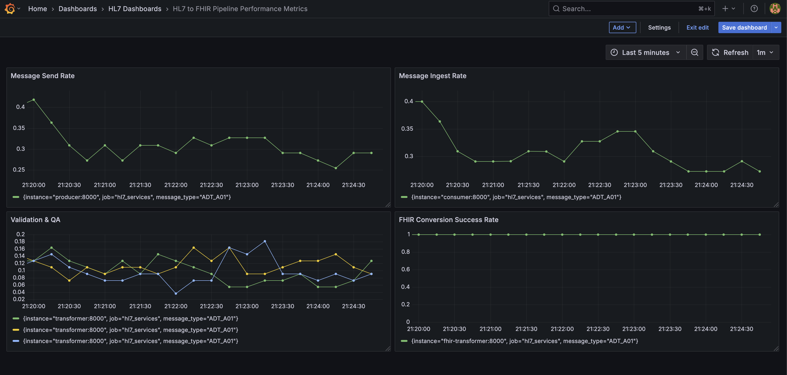

### Objective

The goal of this project is to replicate the data flow of `ADT_A01` messages from providers (i.e. hospitals, clinics, etc.) and the work that a Data Integration Engineer would do to ingest that data.

### Disclaimer

This project is primarily focused on showing familiarity with tools like Docker, S3, and Python, as well as familiarity with healthcare data, including `ADT_A01` messages, MLLP protocol, and the `hl7apy` library. The intention is to keep this pipeline closer to a proof of concept than to production-ready code. As a result, there are some areas that do not adhere to best practices, including the use of the general `Exception` and not making use of a `.env` file to hold environment variables. 

### Architecture

The pipeline is containerized using Docker. A container is created for each of the following services:
- `producer`: Generates a stream of dynamically generated `ADT_A01` messages.  
- `consumer`: Receives and stores the raw messages.
- `storage`: Uses `minio` and `minio-client` containers to act as a proxy for AWS S3 storage.
- `validator`: Reads and parses raw `ADT_A01` messages, validates message structure, and performs data quality checks.  
- `fhir-converter`: Converts `ADT_A01` messages from HL7v2 to FHIR.  
- `fhir-transformer`: Reads messages from the `silver` layer and stores the FHIR equivalent in the `gold` layer.  
- `monitor`: Monitors the pipeline and aggregates performance metrics.

### Producer

The `producer` generates `ADT_A01` messages dynamically by making use of the `faker` and `random` libraries in Python. The [hl7_generators.py](https://github.com/bryanbritten/hl7-integration/blob/main/docker/producer/hl7_generators.py) file defines the functions that create the segments in an `ADT_A01` message. The [helpers.py](https://github.com/bryanbritten/hl7-integration/blob/main/docker/producer/helpers.py) file is responsible for generating the random values that go in each field of the different segments. 

The `faker` library is used to generate random values for names, addresses, SSNs, UUIDs, phone numbers, and birth dates. Additionally, a decorator called `with_error_rate` is used on each value generator to randomly introduce missing values. The error rate is adjustable for each value-generating function.

The `ADT_A01` schema was defined with the help of definitions provided by [Caristix](https://hl7-definition.caristix.com/v2/HL7v2.5/Segments). 

### Validator

The `validator` service reads from the "bronze" layer and validates the messages using the `hl7apy` library in Python. It then performs a series of data quality checks using the same library. If the validation and data quality checks all pass, the raw message is saved in a "silver" layer. Otherwise, the raw message is saved in a `deadletter` bucket for manual review. 

### Storage

`minio` is used to replicate the use of an S3 bucket. A medallion-like architecture is utilized while processing the data. The `consumer` service ingests the raw message and saves in a "bronze" layer, which represents unprocessed data. Typically, the "silver" layer would represent data that has been transformed in some way, but I am using it to represent data that has been validated and QA'd and is ready for conversion into a FHIR format. This FHIR version of the message is what will be saved in the "gold" layer, which represents data ready for analytical querying.

### FHIR Converter

The conversion to FHIR is done with a containered version of the [Microsoft FHIR Converter](https://github.com/microsoft/FHIR-Converter). The image can be found [here](https://hub.docker.com/r/microsoft/healthcareapis-fhir-converter).

### Monitor

The `monitor` service makes use of Grafana and Prometheous to monitor activity in the `producer`, `consumer`, `transformer`, and `fhir-transformer` services. The following metrics are captured:
- Message send rate  
- Message ingest rate  
- Validation & QA Check fail rates  
- FHIR Conversion Success Rate

### How to use

Running this pipeline locally requires Docker. If you have Docker installed, follow these steps:
1. Clone this repository  
2. Navigate into the directory created by Step 1.  
3. Run `docker compose up --build` from your terminal.  

### Next steps

If this were a production environment, there are a few things that could/should be added to improve this pipeline, including:

- ~~Logging~~ (implemented by [8480be2e](https://github.com/bryanbritten/hl7-integration/commit/8480be2e0b959be5378f9510b2da116ef040fd96))
- Testing
- Message queues
- Kubernetes (for scaling generation and consumption services based on need)
- Extended message format handling (`ADT_03`, `ORU_R01`, etc)
- Improved data quality checks
- Business logic checks
- More complex `ADT_A01` messages (repeated segments, z-segments, erroneous segments, etc.)
- Validation and quality quecks on the FHIR data
- Business-centric metrics
- Grafana dashboard defined as code
- Alerts and warnings defined

