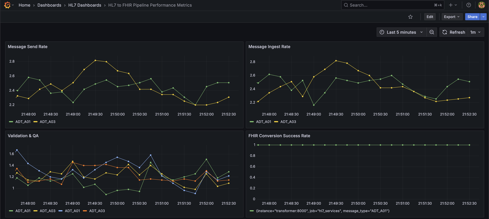

### Objective

The goal of this project is to replicate the data flow of `ADT_A01` and `ADT_A03` messages from providers (i.e. hospitals, clinics, etc.) and the work that a Data Integration Engineer would do to ingest that data.

### Disclaimer

This project is primarily focused on showing familiarity with tools like Docker, S3, and Python, as well as familiarity with healthcare data, including `ADT_A01` and `ADT_A03` messages, MLLP protocol, and the `hl7apy` library. The intention is to keep this pipeline closer to a proof of concept than to production-ready code. As a result, there are some areas that do not adhere to best practices, including the use of the general `Exception` and not making use of a `.env` file to hold environment variables. 

### Architecture

The pipeline is containerized using Docker. A container is created for each of the following services:
- `producer`: Generates a stream of dynamically generated `ADT_A01` and `ADT_A03` messages.  
- `consumer`: Receives and stores the raw messages.
- `storage`: Uses `minio` and `minio-client` containers to act as a proxy for AWS S3 storage.
- `qa`: Reads messages that have passed initial validation and performs additional data quality checks.  
- `fhir-converter`: A containerized version of Microsoft's [FHIR Converter](https://github.com/microsoft/FHIR-Converter).  
- `transformer`: Converts a validated message into the FHIR format using the `fhir-converter` service.  
- `monitor`: Monitors the pipeline and aggregates performance metrics.

### Producer

The `producer` generates `ADT_A01` and `ADT_A03` messages dynamically by making use of the `faker` and `random` libraries in Python. The [hl7_segment_generators.py](https://github.com/bryanbritten/hl7-integration/blob/main/docker/producer/hl7_segment_generators.py) file defines the functions that create the segments in a given message. The [fake_data_generators.py](https://github.com/bryanbritten/hl7-integration/blob/main/docker/producer/fake_data_generators.py) file is responsible for generating the random values that go in each field of the different segments. 

The `faker` library is used to generate random values for names, addresses, SSNs, UUIDs, phone numbers, and birth dates. Additionally, a decorator called `with_error_rate` is used on each value generator to randomly introduce missing values. The error rate is adjustable for each value-generating function.

The `ADT_A01` and `ADT_A03` schemas were defined with the help of definitions provided by [Caristix](https://hl7-definition.caristix.com/v2/HL7v2.5/Segments).

### Consumer

The `consumer` service is responsible for reading messages from Kafka and sending acknowledgement messages (i.e. `MSH-9.1 = ACK`) back to Kafka. On ingest, attempts are made to extract the `MSH` segment from the message both via `hl7apy` and custom logic. If that is successful, attempts are made to further extract the `MSH-1`, `MSH-9`, and `MSH-10` fields. If any of those attempts fail, either getting the `MSH` segment or the desired fields, the message is written to the Dead Letter Queue (i.e. `DLQ` topic) and an acknowledgement with `acknowledgement_code=AE` is written to the `ACKS` topic. If all attempts are successful, the message is written to the `bronze` bucket and an acknowledgement with `acknowledgement_code=AA` is sent to the `ACKS` topic.

### Broker

The `broker` service is a Kafka "cluster" consisting of a sinkgle broker. The topics include `HL7`, `DLQ`, and `ACKS`. The `HL7` topic is the main topic of interest, used by both the `producer` and `consumer` services, and is the topic where all HL7 messages are published to and consumed from. The `DLQ` topic is the Dead Letter Queue and is used to store messages that fail parsing, validation, or data quality checks and is intended to represent the batch of messages that would require manual review in a real-world environment. The `ACKS` topic is used for general acknowledgement messages (i.e. `MSH-9.1 == ACK`) and is intended to represent the messages that an integration engine would send back to the provider to acknowledge receipt of an HL7 message. These two topics, `DLQ` and `ACKS`, are only used by the `consumer` service.

> NOTE: A production-level integration engine would have more brokers in the cluster, and would set the replication factor to a value higher than one. Additionally, the Kafka producers only wait for acknowledgement from the "Leader" partition (i.e. "acks=1"), but in production with a higher replication factor, this should be changed to `acks=-1` so that acknowledgement from all "Leader" and "Follower" partitions is required before moving on.

### QA (Quality Assurance)

The `qa` service reads from the `hl7.accepted` topic in the `broker` service and performs a series of data quality checks using a combination of the `hl7apy` library and custom logic. If the data quality checks all pass, the message is written to the `hl7.validated` topic. Otherwise, the message is written to the `DLQ` topic with the QA failures included in the headers for later inspection. 

### Storage

`minio` is used to replicate the use of an S3 bucket. A medallion-like architecture is utilized while processing the data. The `consumer` service ingests the raw message and saves in a "bronze" layer, which represents unprocessed data. Typically, the "silver" layer would represent data that has been transformed in some way, but I am using it to represent data that has been validated and QA'd and is ready for conversion into a FHIR format. This FHIR version of the message is what will be saved in the "gold" layer, which represents data ready for analytical querying.

### FHIR Converter

The conversion to FHIR is done with a containerized version of the [Microsoft FHIR Converter](https://github.com/microsoft/FHIR-Converter). The image can be found [here](https://hub.docker.com/r/microsoft/healthcareapis-fhir-converter).

### Transformer

The `transformer` service reads a message from the "silver" layer and sends the data to the `convertToFhir` API endpoint in the `fhir-converter` service. Successful conversions are then stored in the "gold" layer, while failed conversions are stored in the `deadletter` bucket.

### Monitor

The `monitor` service makes use of Grafana and Prometheous to monitor activity in the `producer`, `consumer`, `transformer`, and `fhir-transformer` services. The following metrics are captured:
- Message send rate  
- Message ingest rate  
- Validation & QA Check fail rates  
- FHIR Conversion Success Rate

### How to use

Running this pipeline locally requires Docker. If you have Docker installed, follow these steps:
1. Clone this repository  
2. Navigate into the directory created by Step 1.  
3. Run `docker compose up --build` from your terminal.  

### Next steps

If this were a production environment, there are a few things that could/should be added to improve this pipeline, including:

- Testing
- Kubernetes (for scaling producer and consumer services based on need)
- Add support for `ORU_R01` messages
- Improved data quality checks
- More complex messages (repeated segments, z-segments, erroneous segments, etc.)
- Validation and quality quecks on the FHIR data
- Alerts and warnings defined
- ~~Logging~~ (implemented as of [8480be2e](https://github.com/bryanbritten/hl7-integration/commit/8480be2e0b959be5378f9510b2da116ef040fd96))
- ~~Grafana dashboard defined as code~~ (implemented as of [59024efe](https://github.com/bryanbritten/hl7-integration/commit/59024efec96922117e9304bee9b7681f30658c94))
- ~~Message queues~~ (implemented as of [81af8b1d](https://github.com/bryanbritten/hl7-integration/commit/81af8b1d62f42e6b69dc311272de68b2bdfbe230))
- ~~Add support for `ADT_A03` messages~~ (implemented as of [05dfe236](https://github.com/bryanbritten/hl7-integration/commit/05dfe236d967805fdb7199d2e18c0903c5f9d37e))

